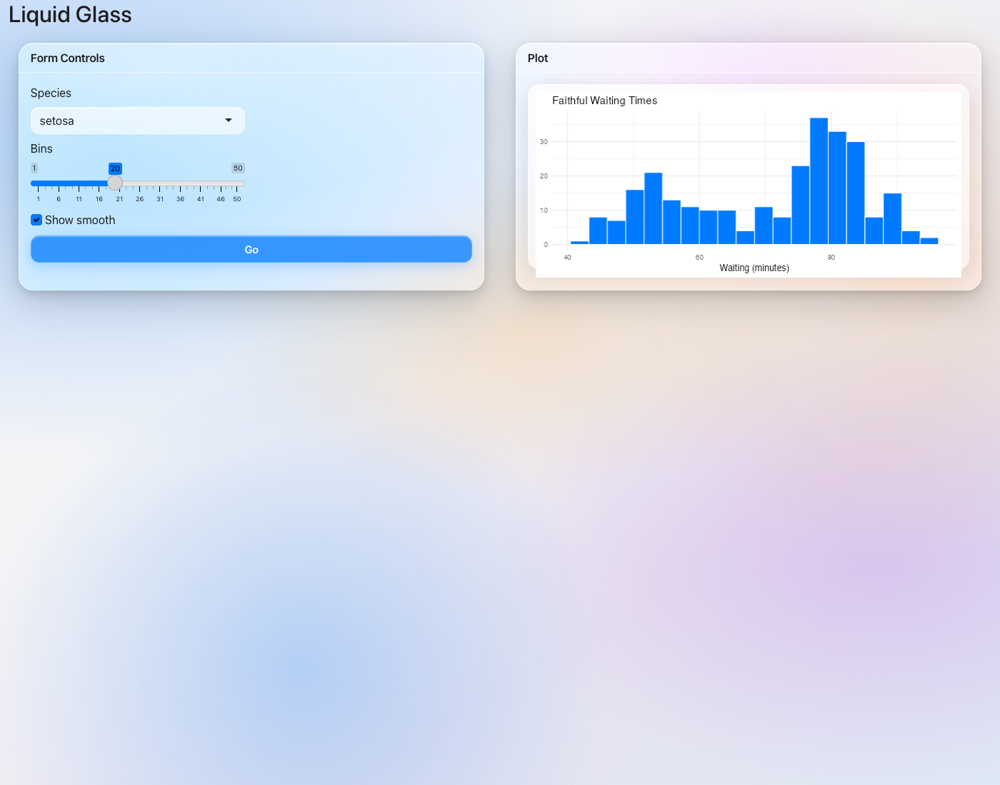

# shinyglass

Apple's [Liquid Glass](https://developer.apple.com/documentation/technologyoverviews/liquid-glass) aesthetic for R Shiny — one function, built on [bslib](https://rstudio.github.io/bslib/).

<p align="center">
  
</p>

## Install

```r
remotes::install_github("ericrayanderson/shinyglass")
```

## Single-file app

Save as `app.R` and run with `shiny::runApp()`:

```r
library(shiny)
library(shinyglass)

ui <- fluidPage(
  theme = glass_theme(),
  titlePanel("Liquid Glass"),
  selectInput("color", "Favorite color", c("Blue", "Purple", "Orange")),
  sliderInput("n", "Number of bars", 5, 30, 15),
  plotOutput("plot")
)

server <- function(input, output, session) {
  output$plot <- renderPlot({
    barplot(
      seq_len(input$n),
      col = "#007AFF",
      border = NA,
      main = paste("You chose", input$color)
    )
  })
}

shinyApp(ui, server)
```

You only need `shiny` and `shinyglass`. **You do not need to load bslib** — `glass_theme()` returns a bslib theme object that `fluidPage()` (and other Shiny page functions) understand automatically.

Load [bslib](https://rstudio.github.io/bslib/) only if you want its UI helpers like `card()` or `page_fillable()`. Standard Shiny inputs, buttons, and layouts work out of the box.

## Options

```r
glass_theme(
  preset     = "dark",   # "light" or "dark"
  primary    = "#007AFF",
  blur       = 28,
  saturation = 200
)
```

## Demo

The bundled demo uses [bslib](https://rstudio.github.io/bslib/) cards and [ggplot2](https://ggplot2.tidyverse.org/). Install them first if needed:

```r
install.packages(c("bslib", "ggplot2"))
shiny::runApp(system.file("examples", "demo-app.R", package = "shinyglass"))
```

## License

GPL-3