# shinyglass

Apple-inspired [Liquid
Glass](https://developer.apple.com/documentation/technologyoverviews/liquid-glass)
themes for R Shiny — one function, built on
[bslib](https://rstudio.github.io/bslib/).

[Documentation](https://ericrayanderson.github.io/shinyglass/) · [Report
an issue](https://github.com/ericrayanderson/shinyglass/issues)

|  |  |
|:--:|:--:|
|  | 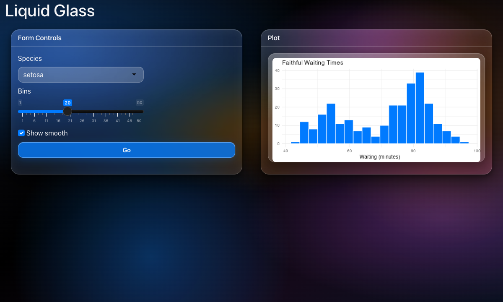 |
| Light | Dark |

## Install

``` r

# install.packages("shinyglass")  # once on CRAN
remotes::install_github("ericrayanderson/shinyglass")
```

## Quick start

Save as `app.R` and run with
[`shiny::runApp()`](https://rdrr.io/pkg/shiny/man/runApp.html):

``` r

library(shiny)
library(shinyglass)

ui <- fluidPage(
  theme = glass_theme(),
  titlePanel("Liquid Glass"),
  selectInput("color", "Favorite color", c("Blue", "Purple", "Orange")),
  sliderInput("n", "Number of bars", 5, 30, 15),
  plotOutput("plot")
)

server <- function(input, output, session) {
  output$plot <- renderPlot({
    barplot(
      seq_len(input$n),
      col = "#007AFF",
      border = NA,
      main = paste("You chose", input$color)
    )
  })
}

shinyApp(ui, server)
```

You only need `shiny` and `shinyglass`.
[`glass_theme()`](https://ericrayanderson.github.io/shinyglass/reference/glass_theme.md)
returns a bslib theme object that
[`fluidPage()`](https://rdrr.io/pkg/shiny/man/fluidPage.html) and other
Shiny page functions understand automatically — you do not need to load
bslib.

Load [bslib](https://rstudio.github.io/bslib/) only if you want its UI
helpers like `card()` or `page_fillable()`. Standard Shiny inputs,
buttons, and layouts work out of the box.

## Customization

``` r

glass_theme(
  preset     = "dark",   # "light" or "dark"
  primary    = "#007AFF",
  blur       = 28,
  saturation = 200
)
```

`preset` switches the full color system — both variants are shown above.

## Example apps

### Demo

The bundled demo uses [bslib](https://rstudio.github.io/bslib/) cards
and [ggplot2](https://ggplot2.tidyverse.org/):

``` r

install.packages(c("bslib", "ggplot2"))
shiny::runApp(system.file("examples", "demo-app.R", package = "shinyglass"))
```

### bslib dashboard

`value_box()`, `layout_columns()`, `navset_card_tab()`, and
`card(full_screen = TRUE)` on a `page_sidebar()` dashboard:

``` r

install.packages(c("bslib", "ggplot2", "DT"))
shiny::runApp(system.file("examples", "bslib-dashboard.R", package = "shinyglass"))
```

|  |  |
|:--:|:--:|
| 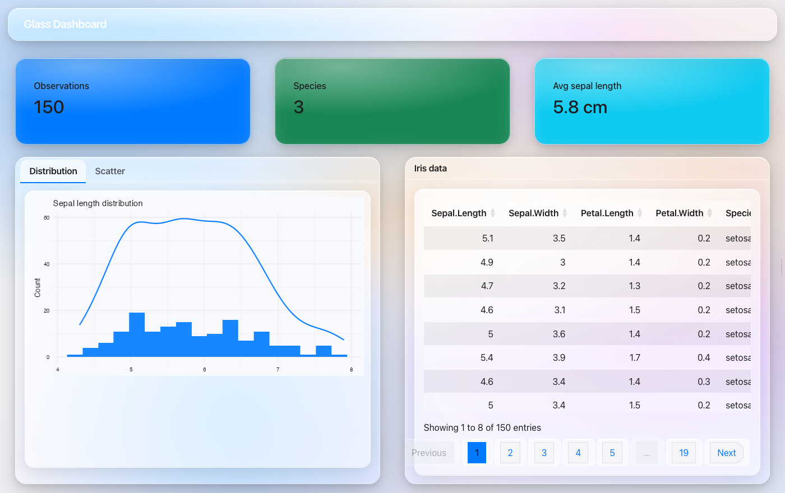 | 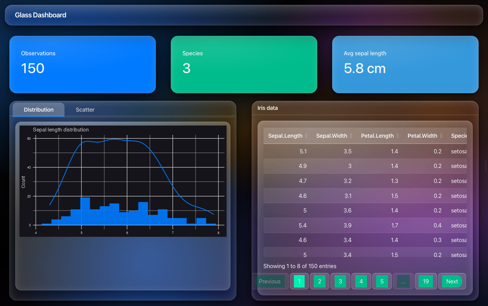 |
| Light | Dark |

### querychat explorer

[querychat](https://posit-dev.github.io/querychat/r/) natural-language
filtering with a glass dashboard layout. Quick-filter buttons work
without an API key; chat requires an LLM credential
(e.g. `OPENAI_API_KEY`):

``` r

install.packages(c("querychat", "duckdb", "DT", "ggplot2"))
shiny::runApp(system.file("examples", "querychat-demo.R", package = "shinyglass"))
```

|  |  |
|:--:|:--:|
| 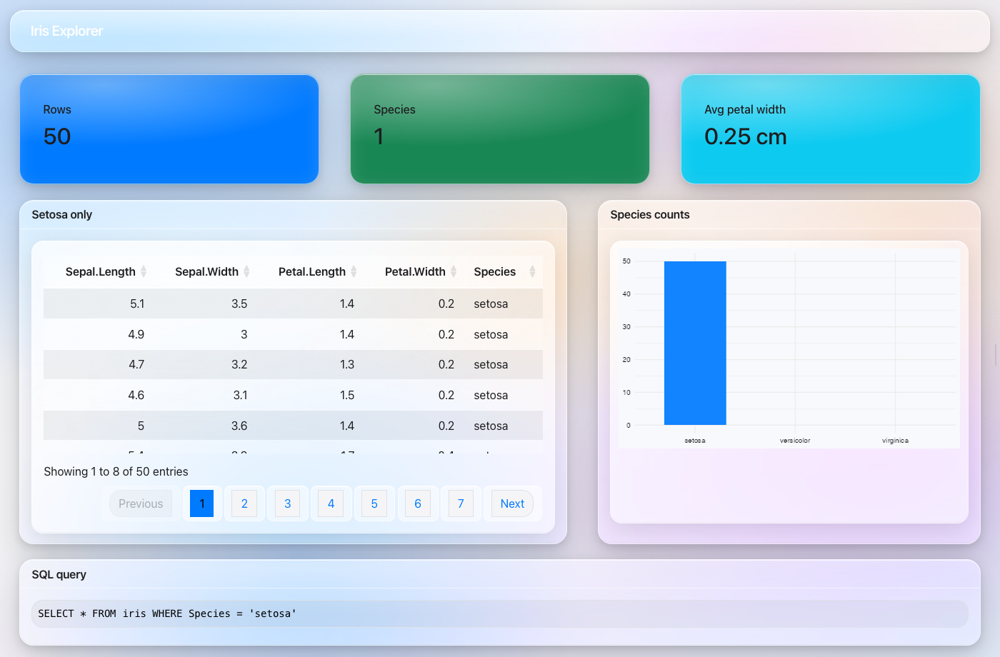 |  |
| Light | Dark |

### dreamRs apps

Real-world dashboards from
[dreamRs/shinyapps](https://github.com/dreamRs/shinyapps) with
[`glass_theme()`](https://ericrayanderson.github.io/shinyglass/reference/glass_theme.md)
applied. Useful for spotting styling gaps on custom CSS, legacy widgets,
and third-party outputs (leaflet, reactable, apexcharter,
shinydashboard).

``` r

install.packages(c(
  "shinyWidgets", "ggplot2", "reactable", "apexcharter",
  "leaflet", "sf", "billboarder", "shinydashboard"
))
shiny::runApp(system.file("examples", "dreamrs-gh-dashboard.R", package = "shinyglass"))
shiny::runApp(system.file("examples", "dreamrs-olympic-medals.R", package = "shinyglass"))
shiny::runApp(system.file("examples", "dreamrs-tdb-naissances.R", package = "shinyglass"))
shiny::runApp(system.file("examples", "dreamrs-ratp-traffic.R", package = "shinyglass"))
```

| App | Light | Dark |
|----|----|----|
| GitHub dashboard | 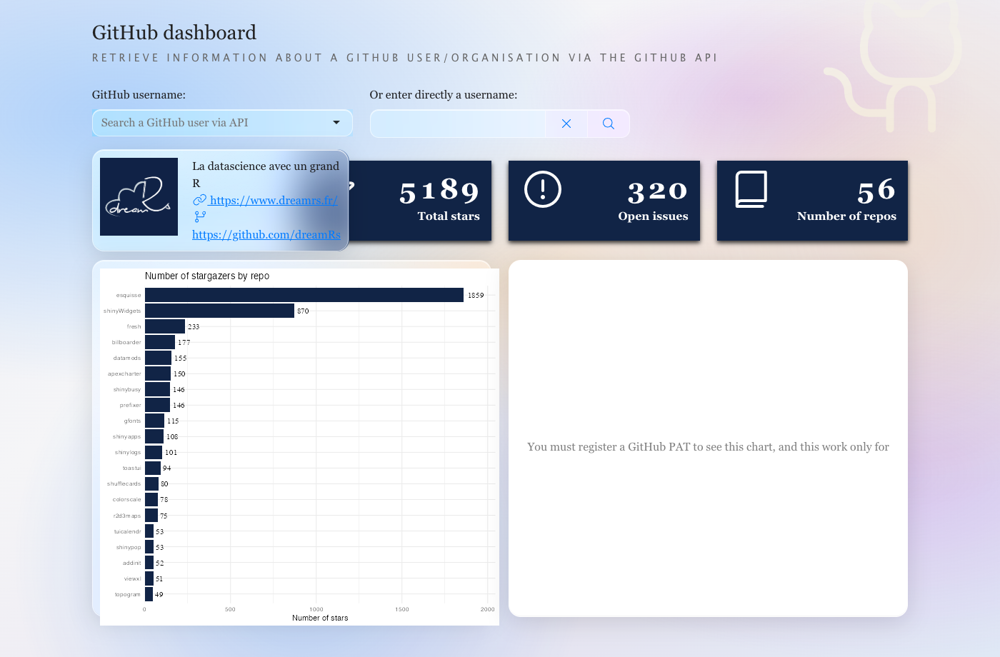 |  |
| Olympic medals | 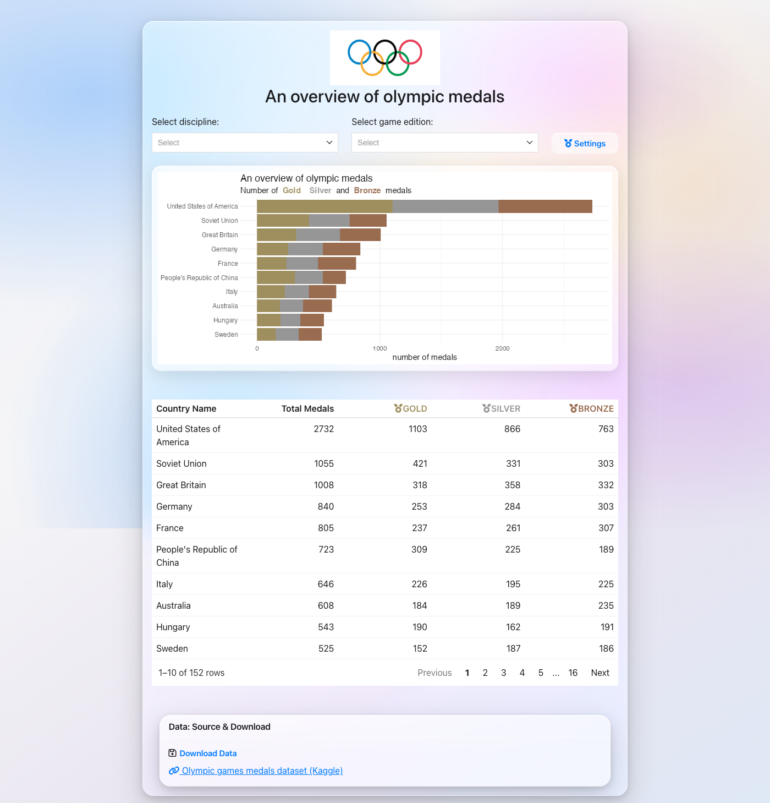 |  |
| Births in France | 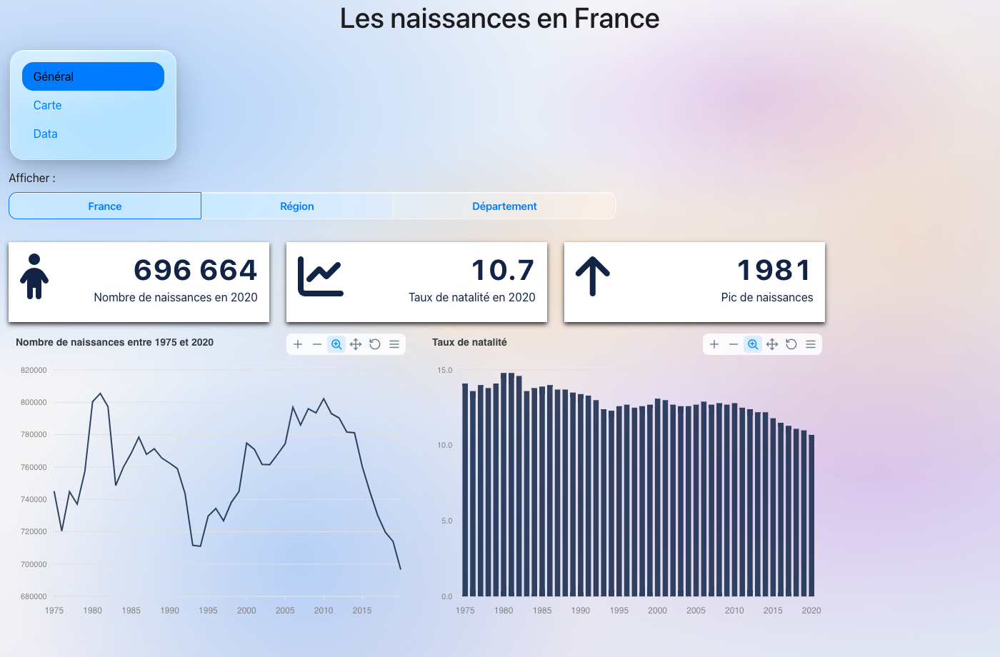 |  |
| Paris metro | 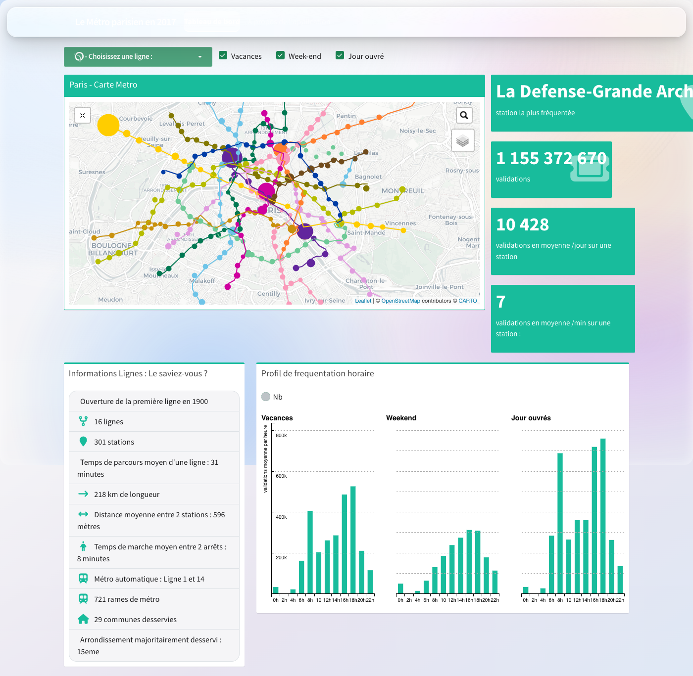 | 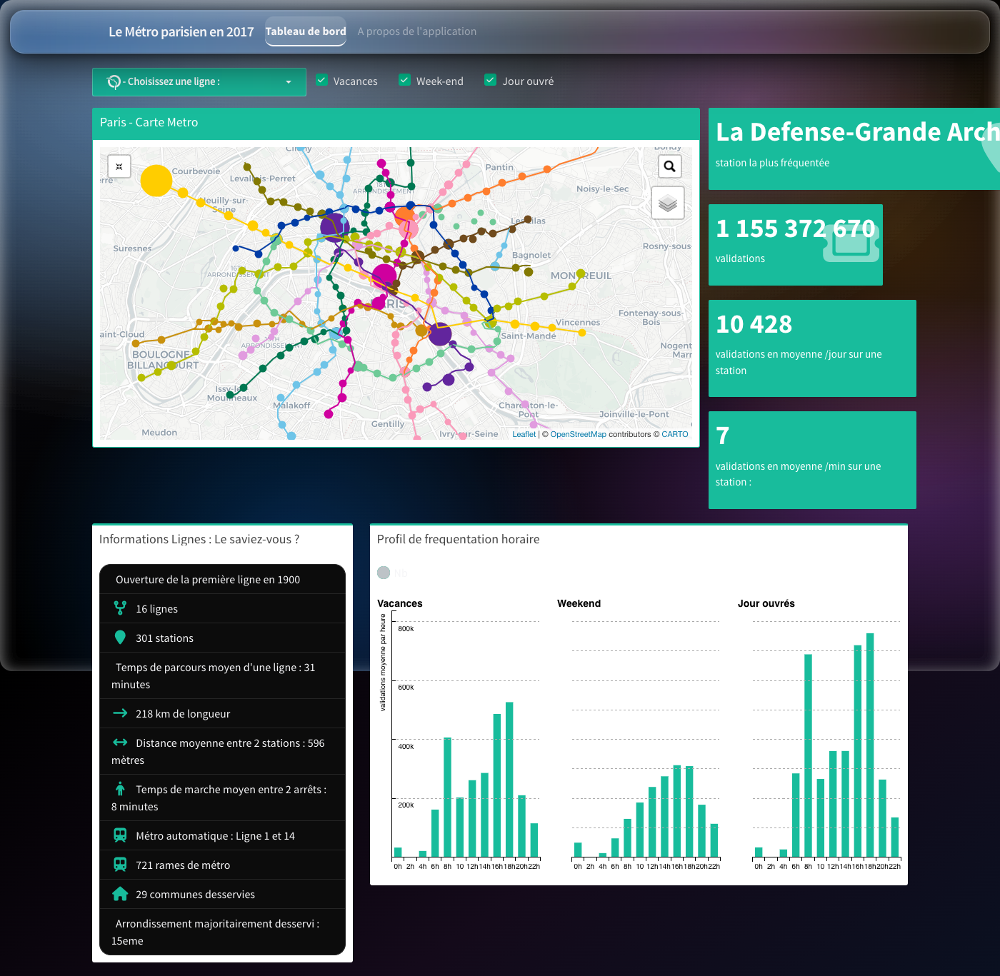 |

Re-capture screenshots (requires
[chromote](https://rstudio.github.io/chromote/)):

``` bash
Rscript inst/scripts/capture-dreamrs-screenshots.R
```

### Reference app

Sidebar overlay, content-aware tinting, and DataTables:

``` r

shiny::runApp(system.file("examples", "apple-glass-reference.R", package = "shinyglass"))
```

Dark preset:

``` r

Sys.setenv(SHINYGLASS_PRESET = "dark")
shiny::runApp(system.file("examples", "apple-glass-reference.R", package = "shinyglass"))
```

|  |  |
|:--:|:--:|
| 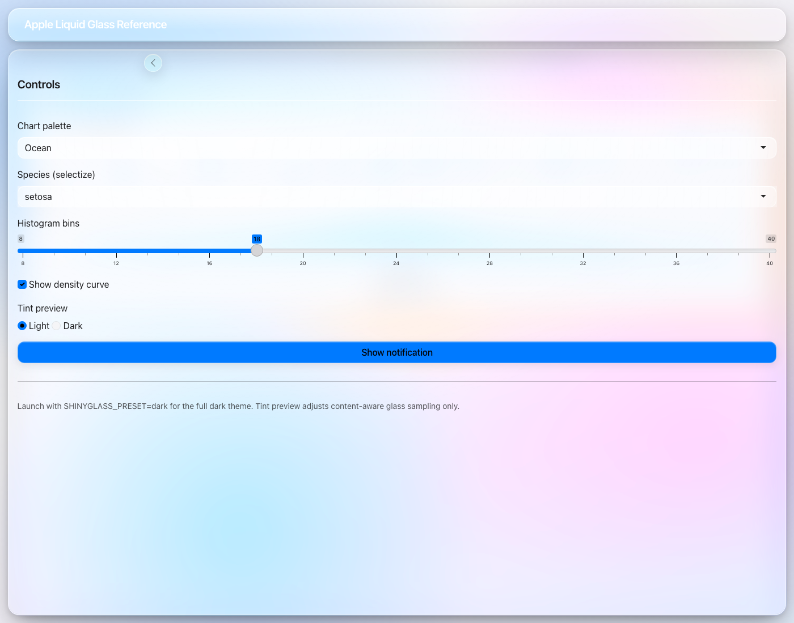 |  |
| Light | Dark |

## Gallery

Official [Shiny
examples](https://github.com/rstudio/shiny/tree/main/inst/examples) with
[`glass_theme()`](https://ericrayanderson.github.io/shinyglass/reference/glass_theme.md)
applied:

|  |  |  |  |
|:--:|:--:|:--:|:--:|
|  |  |  | 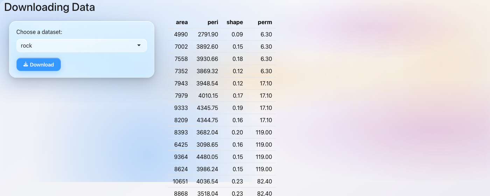 |
| fluidPage + sidebar | Pill tab bar | actionButton | downloadButton |
|  |  | 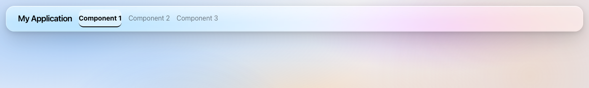 |  |
| DataTables | selectizeInput | navbarPage | page_sidebar |

## License

GPL-3
