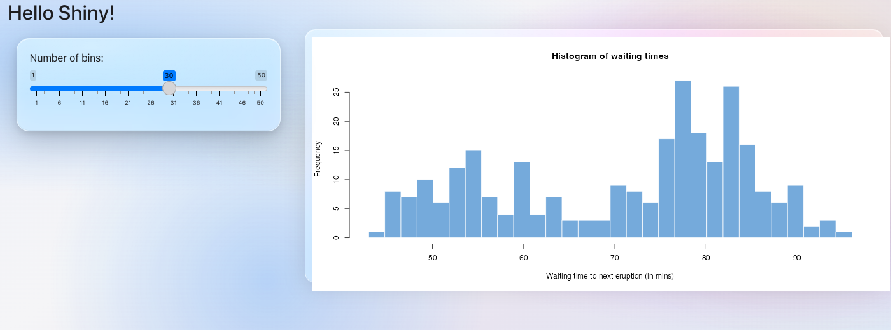
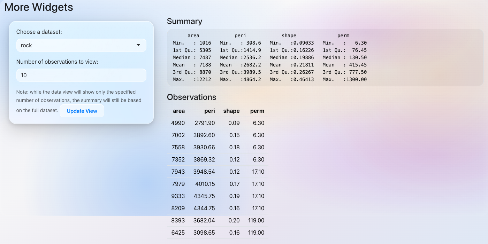
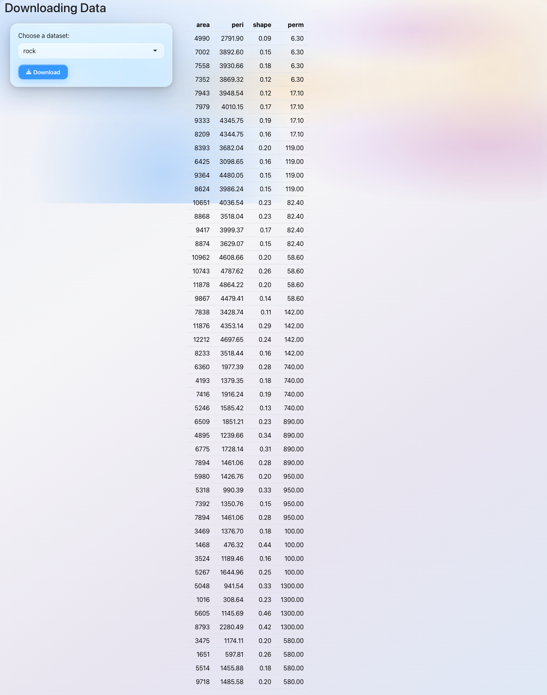
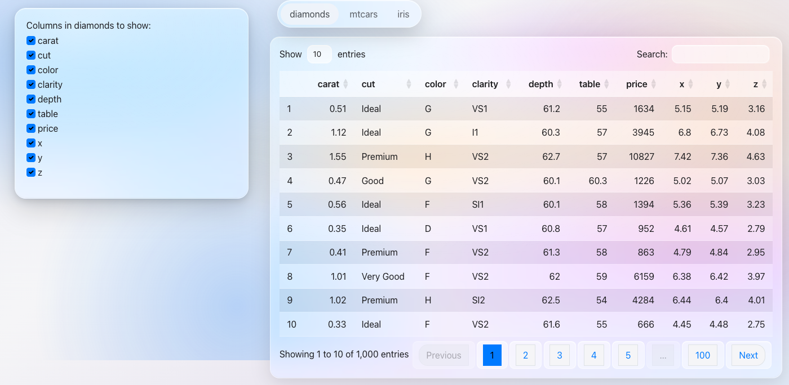
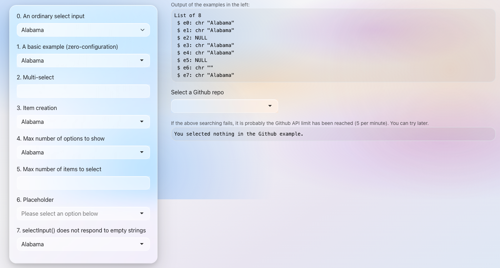
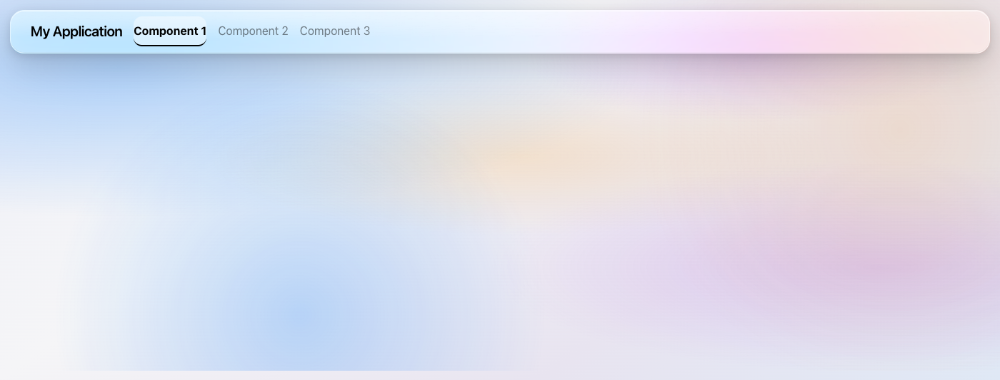
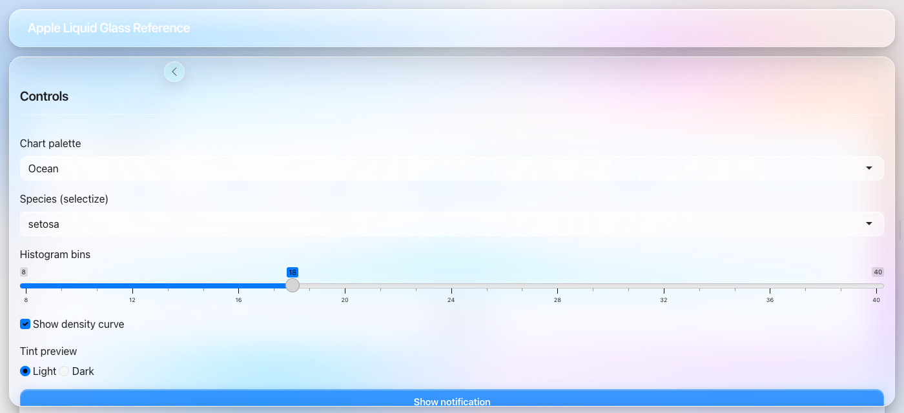

Apple’s [Liquid
Glass](https://developer.apple.com/documentation/technologyoverviews/liquid-glass)
aesthetic for R Shiny — one function, built on
[bslib](https://rstudio.github.io/bslib/).


## Install

``` r

remotes::install_github("ericrayanderson/shinyglass")
```

## Single-file app

Save as `app.R` and run with
[`shiny::runApp()`](https://rdrr.io/pkg/shiny/man/runApp.html):

``` r

library(shiny)
library(shinyglass)

ui <- fluidPage(
  theme = glass_theme(),
  titlePanel("Liquid Glass"),
  selectInput("color", "Favorite color", c("Blue", "Purple", "Orange")),
  sliderInput("n", "Number of bars", 5, 30, 15),
  plotOutput("plot")
)

server <- function(input, output, session) {
  output$plot <- renderPlot({
    barplot(
      seq_len(input$n),
      col = "#007AFF",
      border = NA,
      main = paste("You chose", input$color)
    )
  })
}

shinyApp(ui, server)
```

You only need `shiny` and `shinyglass`. **You do not need to load
bslib** —
[`glass_theme()`](https://ericrayanderson.github.io/shinyglass/reference/glass_theme.md)
returns a bslib theme object that
[`fluidPage()`](https://rdrr.io/pkg/shiny/man/fluidPage.html) (and other
Shiny page functions) understand automatically.

Load [bslib](https://rstudio.github.io/bslib/) only if you want its UI
helpers like `card()` or `page_fillable()`. Standard Shiny inputs,
buttons, and layouts work out of the box.

## Options

``` r

glass_theme(
  preset     = "dark",   # "light" or "dark"
  primary    = "#007AFF",
  blur       = 28,
  saturation = 200
)
```

## Demo

The bundled demo uses [bslib](https://rstudio.github.io/bslib/) cards
and [ggplot2](https://ggplot2.tidyverse.org/). Install them first if
needed:

``` r

install.packages(c("bslib", "ggplot2"))
shiny::runApp(system.file("examples", "demo-app.R", package = "shinyglass"))
```

Apple Liquid Glass reference app (sidebar overlay, tinting, DataTables):

``` r

shiny::runApp(system.file("examples", "apple-glass-reference.R", package = "shinyglass"))
```

## Gallery

Screenshots from official [Shiny
examples](https://github.com/rstudio/shiny/tree/main/inst/examples) with
[`glass_theme()`](https://ericrayanderson.github.io/shinyglass/reference/glass_theme.md)
applied.

|  |  |  |  |
|:--:|:--:|:--:|:--:|
|  |  |  |  |
| fluidPage + sidebar | Pill tab bar | actionButton | downloadButton |
|  |  |  |  |
| DataTables | selectizeInput | navbarPage | page_sidebar |

## License

GPL-3
